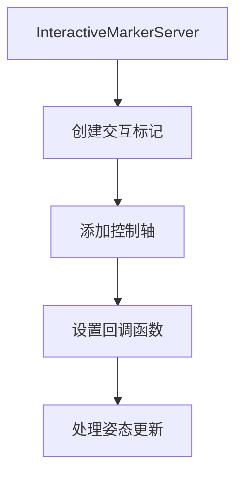

# ROS2 Interactive Marker 功能包

## 功能概述
本功能包演示了ROS2中Interactive Markers的使用，实现了一个可通过rviz2交互控制的3D标记。

## 详细功能
- **3D标记控制**:
  - X/Y/Z轴独立移动控制
  - Z轴位置锁定功能
- **可视化效果**:
  - 蓝色立方体标记
  - 实时姿态反馈

## 技术实现

## 使用示例
1. 启动节点后，在rviz2中添加InteractiveMarkers显示
2. 选择标记并拖动控制轴进行交互
3. 观察终端中的姿态反馈信息

## 代码结构
- `interactive_marker_server.cpp`: 主节点实现
  - 创建交互标记服务器
  - 定义标记和控制方式
  - 处理用户交互反馈

## 扩展建议
- 添加更多控制类型(旋转/缩放)
- 实现多标记交互
- 添加标记创建/删除功能
