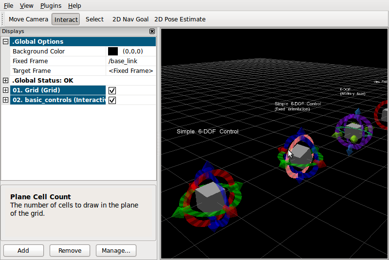
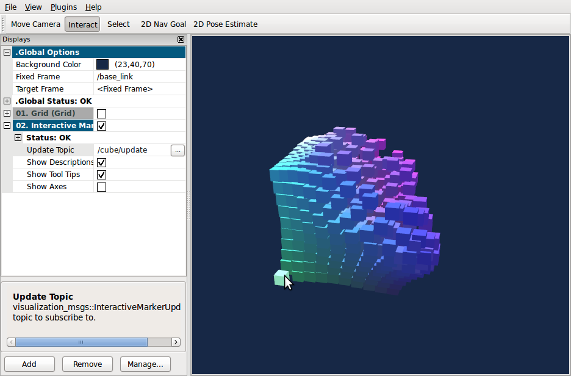
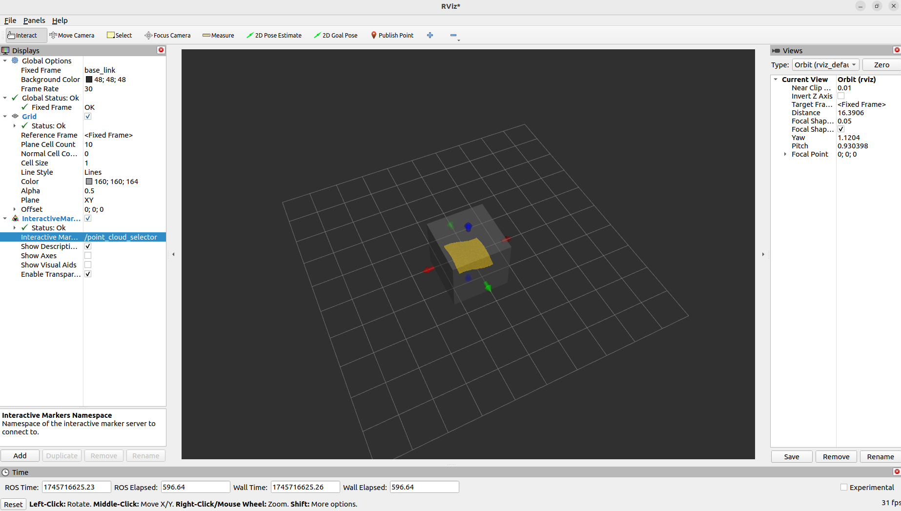
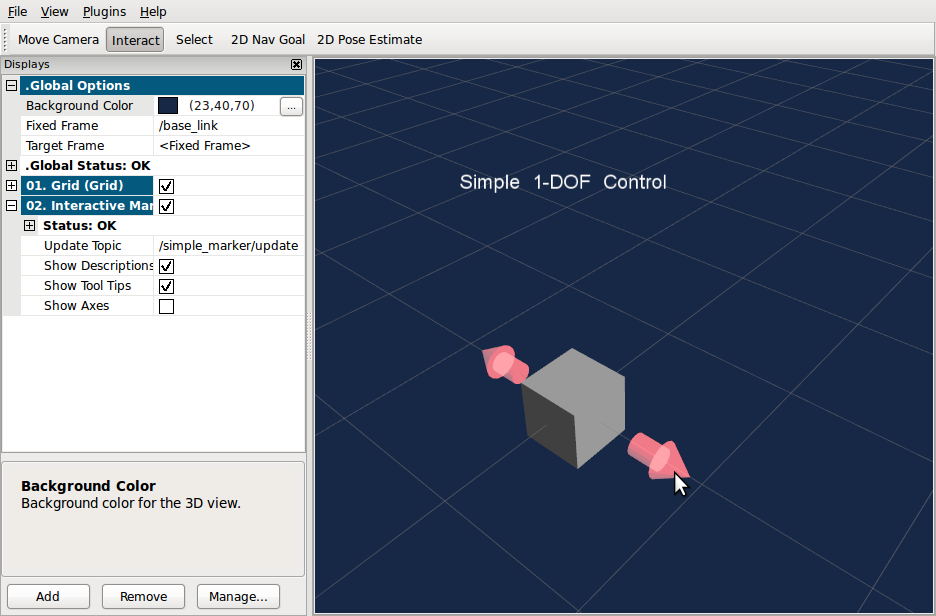
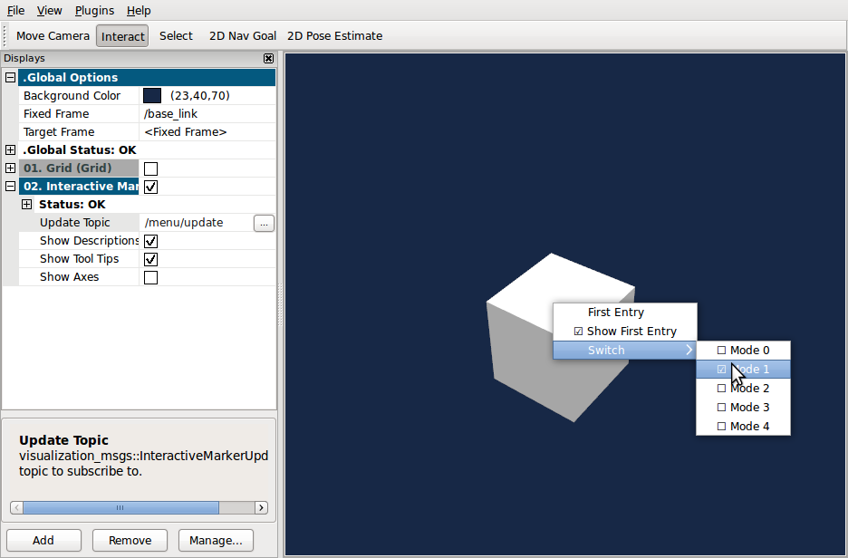
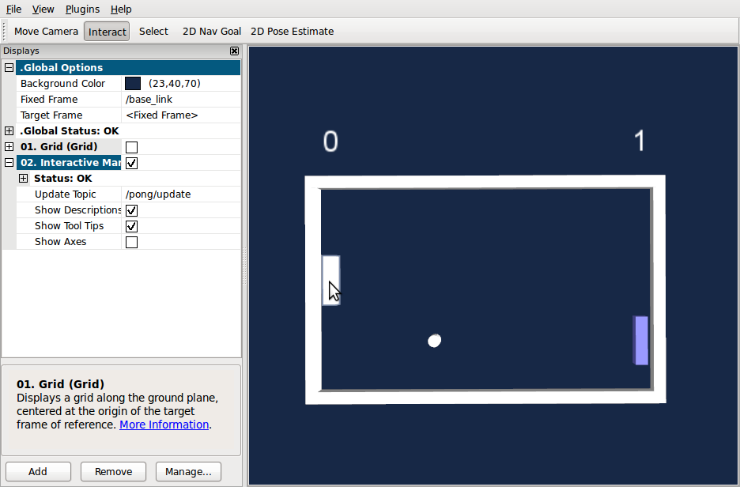

# Interactive Marker Tutorials (C++版本)

## 项目简介
ROS2交互式标记教程的C++实现，包含多种交互式标记示例。

参考官方文档:https://wiki.ros.org/rviz/Tutorials/Interactive%20Markers%3A%20Getting%20Started


## 编译和运行
### 使用build.sh编译
```bash
# 给予执行权限
chmod +x build.sh

# 编译项目
bash build.sh
```

### 使用run.sh运行示例
```bash 
# 运行交互式菜单
bash run.sh

# 根据菜单选择示例(1-6):
# 1. Basic Controls (基本控制)
# 2. Cube (立方体) 
# 3. Selection (选择)
# 4. Simple Marker (简单标记)
# 5. Menu (菜单)
# 6. Pong Game (乒乓球游戏)
```

## RViz2可视化配置
1. 启动RViz2:
```bash
rviz2
```

2. 添加配置:
- 点击"Add"按钮
- 选择"InteractiveMarkers"
- 设置Topic为"/basic_controls/update" 
- 设置Fixed Frame为"base_link"

3. 可选: 添加TF显示查看坐标系

## 示例说明
1. **Basic Controls**: 基础6自由度控制，展示平移和旋转交互

    

2. **Cube**: 立方体交互示例，演示简单几何体控制  

    
3. **Selection**: 对象选择功能，展示交互式选择机制

    

4. **Simple Marker**: 简单标记演示，基础交互标记实现

    

5. **Menu**: 右键菜单功能，展示上下文菜单交互

    

6. **Pong Game**: 乒乓球游戏交互，展示复杂交互应用

    

## 常见问题排查
### 在RViz2中看不到标记
1. 确认Fixed Frame设置为"base_link"
2. 检查话题是否为"/basic_controls/update"
3. 查看终端是否有错误输出
4. 验证TF变换:
```bash
ros2 run tf2_ros tf2_echo base_link moving_frame
```

### 编译失败
1. 确保ROS2环境已source:
```bash
source /opt/ros/humble/setup.bash
```
2. 检查依赖是否安装完整:
```bash
rosdep install -i --from-path src --rosdistro humble -y
```

### 运行时报错
1. 确保已正确编译项目
2. 检查工作空间是否已source:
```bash
source install/setup.bash
```
3. 确认没有其他同名节点在运行
